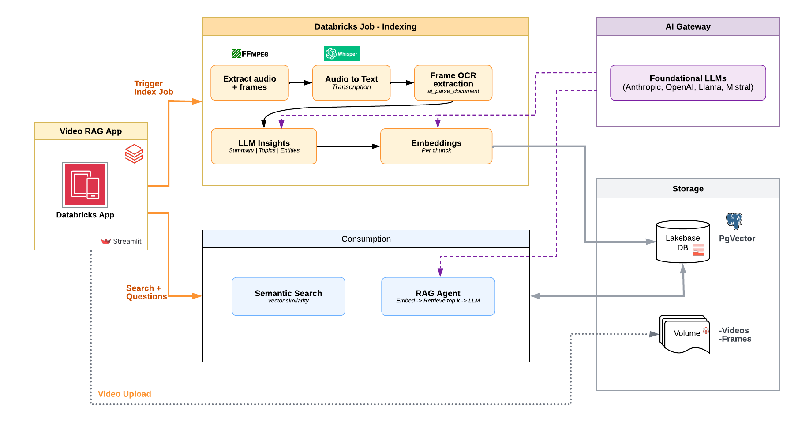

# 🎬 videoRAG

**Indexación y búsqueda semántica de videos sobre Databricks + Lakebase (pgvector).**

videoRAG es una [Databricks App](https://docs.databricks.com/en/dev-tools/databricks-apps/index.html) (Streamlit) nativa en Databricks. Permite **subir videos**, **indexarlos** (transcripción de audio, OCR de los cuadros, extracción de entidades, temas y capítulos), **buscarlos semánticamente** y **conversar con un agente RAG** que responde citando el video y el minuto exacto.

Todo el contenido indexado y sus *embeddings* viven en **Lakebase** (PostgreSQL gestionado) usando **pgvector**.

---

## ✨ Funcionalidades

- **Subida de videos** a un UC Volume (organizados por colección).
- **Indexación automática** (Job de Databricks):
  - 🗣️ **Transcripción** del audio con Whisper (segmentos + timestamps + idioma).
  - 🔤 **OCR** de los cuadros con `ai_parse_document` (texto en pantalla).
  - 📝 **Resumen + temas**, 🔎 **entidades** (personas, organizaciones, productos, lugares…) y 📑 **capítulos** con timestamps, vía LLM.
  - 🧠 **Embeddings** por chunk (transcripción y OCR).
- **Búsqueda semántica** (cosine / pgvector HNSW) sobre transcripción y/o texto en pantalla, con salto al minuto.
- **Agente conversacional (RAG)** que responde con base en el contenido indexado y **cita video + timestamp**.
- **Colecciones**: agrupan videos y tienen su **propia configuración** (modelos, compute, idioma…) persistida en la base de datos.
- **Dedup de frames** a nivel visual (perceptual hash) y de texto, para no repetir OCR cuando una imagen dura varios segundos.
- **Compute CPU o GPU** seleccionable por colección.
- **Reindexado** por video o por colección con un clic.

---

## 🏗️ Arquitectura



**Flujo de consulta:**
- **🔍 Búsqueda semántica** — el texto del query se convierte a *embedding* (Foundation Models) y se buscan los chunks más cercanos en Lakebase (`cosine` sobre índice **HNSW** de pgvector). Devuelve fragmentos de transcripción y/o OCR con su video y timestamp; se puede acotar a la colección activa o a todas.
- **💬 Agente RAG** — recupera los top-k chunks relevantes (mismo embedding + pgvector), arma el contexto y llama al **LLM**, que responde **citando el video y el minuto** de cada dato. Opera sobre la colección activa (o todas).

**Por qué un Job aparte:** la App de Databricks es ligera (sin GPU ni librerías pesadas). El trabajo pesado — ffmpeg, Whisper, OCR, embeddings — corre en un **Job** que la App dispara vía `jobs.run_now`. La App solo sube el archivo, lanza el Job y luego **consulta** Lakebase (búsqueda y agente).

### Componentes

| Ruta | Descripción |
|------|-------------|
| `app/` | Databricks App (Streamlit): subir, biblioteca, búsqueda, agente, colecciones, configuración. |
| `app/app.py` | UI principal (navegación, vistas). |
| `app/config.py` | Config dual-mode (local vs App) + resolución de Lakebase/host + config por colección. |
| `app/db.py` | Acceso a Lakebase (pgvector): CRUD de colecciones/videos, búsqueda vectorial, esquema. |
| `app/fm.py` | Cliente de Foundation Models (embeddings + LLM) vía API OpenAI-compatible. |
| `app/agent.py` | Motor RAG (retrieve + prompt + citas). |
| `app/storage.py` | Subida a UC Volume + disparo del Job de indexación. |
| `indexer/indexer.py` | Notebook del Job de indexación (audio → Whisper → frames → OCR → LLM → embeddings → Lakebase). |
| `sql/schema.sql` | Esquema de Lakebase (pgvector + tablas). |

### Modelo de datos (Lakebase)

`collections` → `videos` → { `video_chunks` (embeddings), `video_entities`, `video_chapters` }. Ver [`sql/schema.sql`](sql/schema.sql).

---

## 🚀 Puesta en marcha

### Prerrequisitos
- Un **workspace de Databricks** con serverless habilitado (para Foundation Models y SQL warehouse).
- Un **proyecto Lakebase** (PostgreSQL autoscaling) — provee host + database.
- **Databricks CLI** ≥ 0.240 autenticado (`databricks auth login`).
- Un **SQL Warehouse** serverless (para el OCR con `ai_parse_document`).

### 1. Crear el almacenamiento (UC)
```sql
CREATE SCHEMA IF NOT EXISTS <catalog>.video_indexer;
CREATE VOLUME IF NOT EXISTS <catalog>.video_indexer.uploads;
CREATE VOLUME IF NOT EXISTS <catalog>.video_indexer.frames;
```

### 2. Crear el esquema en Lakebase
Ejecuta [`sql/schema.sql`](sql/schema.sql) contra la base del proyecto Lakebase (o usa el botón **Inicializar esquema** en la app).

### 3. Desplegar el Job de indexación
Importa `indexer/indexer.py` como notebook y crea un Job. Recomendado: **cluster clásico single-node** (p. ej. `m5d.xlarge`, on-demand) para CPU, o `g4dn.xlarge` con runtime **GPU ML** para GPU. Anota el `job_id` (y el de GPU si lo creas).

> ⚠️ El OCR (`ai_parse_document`) **no** está disponible en el Spark del cluster clásico; el Job lo ejecuta contra un **SQL Warehouse serverless** vía la Statement Execution API (parámetro `warehouse_id`).

### 4. Desplegar la App
```bash
databricks sync app/ /Workspace/Users/<tu-usuario>/videoRAG-app --exclude __pycache__
databricks apps create videorag
databricks apps deploy videorag --source-code-path /Workspace/Users/<tu-usuario>/videoRAG-app
```

### 5. Permisos del service principal de la App
El SP de la App (su `client_id`) necesita:
- **Lakebase**: un rol de Postgres con su `client_id` + `GRANT` sobre las tablas, y `CAN USE` sobre el proyecto.
  ```sql
  CREATE ROLE "<sp_client_id>" WITH LOGIN;
  GRANT USAGE ON SCHEMA public TO "<sp_client_id>";
  GRANT SELECT, INSERT, UPDATE, DELETE ON ALL TABLES IN SCHEMA public TO "<sp_client_id>";
  GRANT USAGE, SELECT ON ALL SEQUENCES IN SCHEMA public TO "<sp_client_id>";
  ```
- **UC**: `USE CATALOG`, `USE SCHEMA`, `WRITE VOLUME` (uploads) y `READ VOLUME` (frames).
- **Jobs**: `CAN MANAGE RUN` sobre el/los Job(s) de indexación.
- **Foundation Models**: acceso a los endpoints (normalmente disponible por defecto).

---

## ⚙️ Configuración

La App detecta el entorno automáticamente:
- **Local**: usa un perfil del CLI (`DATABRICKS_PROFILE`) y tu identidad para Lakebase.
- **Databricks App**: usa el service principal inyectado. Como el proyecto Lakebase es **autoscaling** (no soporta el *binding* de recurso `database`), la conexión va por variables de entorno planas: `PGUSER` = `client_id` del SP y el password es su token OAuth.

Variables de entorno en [`app/app.yaml`](app/app.yaml) — **ajústalas a tu entorno**:

| Variable | Descripción |
|----------|-------------|
| `PGHOST`, `PGPORT`, `PGDATABASE`, `PGUSER` | Conexión a Lakebase (`PGUSER` = client_id del SP). |
| `UC_CATALOG`, `UC_SCHEMA` | Catálogo/esquema de los UC Volumes. |
| `INDEXER_JOB_ID`, `INDEXER_JOB_ID_GPU` | Jobs de indexación CPU / GPU. |
| `EMBEDDING_ENDPOINT` | Modelo de embeddings (1024 dims, p. ej. `databricks-gte-large-en`). |
| `LLM_ENDPOINT` | LLM para agente y enriquecimiento (p. ej. `databricks-claude-sonnet-5`). |

La configuración de **modelos, indexación (Whisper/frames/idioma/compute) y top-k** se define **por colección** (persistida en la BD) desde la vista *Colecciones*; la vista *Configuración* deja solo la infraestructura (Lakebase, volúmenes) y diagnósticos.

---

## 💵 Notas de costo (orientativo)

> ⚠️ **Aviso:** las cifras de esta sección son **estimaciones** calculadas con **precios públicos
> de lista** (USD) con fines ilustrativos. **No constituyen una cotización.** El costo real puede
> variar según la **nube** (AWS/Azure/GCP), la **región**, los **precios vigentes**, el **tier/edición**
> de Databricks, tus **descuentos o tarifas negociadas** y la **configuración de la colección**.
> Valida siempre con la [calculadora de precios de Databricks](https://www.databricks.com/product/pricing)
> y los precios de tu proveedor de nube.

Los números de abajo sirven para dimensionar. El costo lo dominan el **tiempo de cluster** y el
**OCR por frame**; los embeddings son despreciables.

**Supuestos:** Whisper `small`, 1 frame cada 5 s para OCR (`ai_parse_document` en SQL Warehouse
serverless), 3 llamadas de enriquecimiento al LLM (`claude-sonnet-5`), embeddings
`gte-large-en`. **CPU** = `m5d.xlarge` single-node clásico (ON_DEMAND, `faster-whisper` int8,
tarifa all-in **~$0.35/hora**); **GPU** = `g4dn.xlarge` (T4, `openai-whisper`, tarifa all-in
**~$0.85/hora**). Incluye ~5–7 min de arranque en frío del cluster.

> ⚠️ Todas las celdas de costo son **por video** (costo total de indexar ese video), **no** por
> hora. El renglón de *cluster* = tiempo del job × la tarifa por hora de arriba.

### Comparativo por video

| Concepto | Video 20 min | Video 1 h |
|---|---|---|
| Frames a OCR (@ 5 s) | ~240 | ~720 |
| Fragmentos indexados (transcripción + OCR) | ~150–250 | ~500–800 |
| **⏱️ Tiempo de indexación — CPU** | **~20–25 min** | **~55–75 min** |
| **⏱️ Tiempo de indexación — GPU** | **~5–8 min** | **~12–18 min** |
| Cluster (tiempo del job) — CPU | ~$0.12–0.18 | ~$0.30–0.45 |
| Cluster (tiempo del job) — GPU | ~$0.08–0.12 | ~$0.15–0.25 |
| OCR (`ai_parse_document`, warehouse serverless) | ~$0.05–0.15 | ~$0.15–0.45 |
| LLM enriquecimiento (3 llamadas) | ~$0.03–0.08 | ~$0.06–0.15 |
| Embeddings | <$0.01 | ~$0.01–0.02 |
| **💵 Total estimado — CPU** | **~$0.25–0.55** | **~$0.60–1.15** |
| **💵 Total estimado — GPU** | **~$0.20–0.45** | **~$0.45–0.90** |

> **Lectura rápida:** para clips cortos CPU y GPU cuestan parecido, pero **para videos largos la
> GPU suele salir más barata y mucho más rápida**, porque el tiempo de cluster (que domina el costo)
> se reduce ~5×.

**Palancas para bajar el costo:**
- **Whisper más ligero** (`base`/`tiny`) si no necesitas máxima fidelidad de transcripción.
- **Subir el intervalo de frames** (p. ej. 10–15 s) → menos llamadas de OCR, el mayor ahorro en videos largos.
- **GPU para lotes o videos largos**; CPU para pruebas puntuales.
- **Mantener el cluster tibio** al indexar varios videos seguidos (evita pagar el arranque en frío repetido).

---

## 🧠 Aprendizajes / gotchas

- **Whisper aborta (SIGABRT) en serverless CPU** por conflicto de librerías nativas → el Job corre en **cluster clásico** (o GPU). En CPU se usa `faster-whisper` (int8); en GPU, `openai-whisper`.
- **Cluster del Job: usar ON_DEMAND**, no spot (el driver spot se reclama a mitad de transcripciones largas).
- **`ai_parse_document` no corre en Spark clásico** → se ejecuta vía SQL Warehouse serverless (Statement Execution API).
- **Spark SQL se come el backslash de los literales**: `'\s+'` se convierte en el patrón `s+` (¡borra todas las "s"!). La normalización de espacios se hace en Python, no en SQL.
- **Modelos de razonamiento (claude-sonnet-5)**: no aceptan el parámetro `temperature` y devuelven `content` como **lista de bloques**, no string.
- **El modelo de embeddings debe ser consistente por colección** (todos los chunks con el mismo modelo, 1024 dims). Al cambiarlo, reindexa la colección.

---

## 🗺️ Roadmap / ideas

- Miniaturas (thumbnails) en el navegador de videos.
- Detección de idioma/sentimiento por segmento.
- Control de acceso por colección.
- Persistencia de la selección de compute por defecto.

---

_Construido sobre Databricks Apps · Lakebase (pgvector) · Foundation Model APIs._
